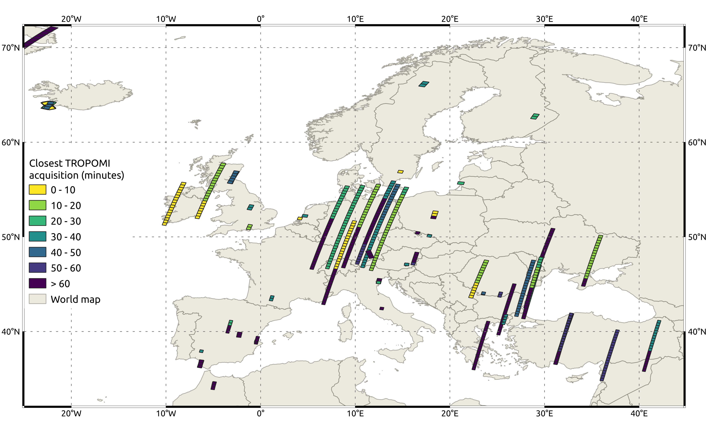

# Collocated EnMAP and temporally closest Sentinel-5P TROPOMI acquisitions

|  |
|:--:|
|*Sample output of collocated cases over Europe in March 2024*|

This project supports work conducted for my master's thesis. The thesis investigates the use of neural networks to retrieve atmospheric NO2 concentrations from the EnMAP hyperspectral imager. A necessary step to achieve this is the identification of collocated EnMAP and TROPOMI acquisitions that are used to train a neural network model. The temporal offset between acquisitions should be minimized so that both instruments capture almost the same conditions. The code developed in this project provides a Python workflow to

1. identify collocated EnMAP and TROPOMI acquisitions,
2. identify the temporal offsets between acquisitions,
3. export EnMAP tile geometries and offsets to the temporally closest TROPOMI acquisition as a GeoPackage file, 
4. and visualize the results using a PyQGIS.
   
This workflow is split up into the three scripts collocated.py, collocated_to_gpkg.py, and visualize.py (executed in this order). Each script contains inline documentation and is described below.

## [collocated.py](code/collocated.py) 

This script is responsible for identifying collocated EnMAP and TROPOMI acquisitions and the temporal offset between them. A list of TROPOMI L2 files and an EnMAP metadata KML file are needed as inputs to analyze. The script outputs a text file with information about each temporally closest collocated case.

First, the area of interest is set, paths to the data are defined and timeframe for analysis is set. This timeframe can be set to an entire year, a specific month, or a specific day. By default, the spatial extent is set to Europe (broadly speaking), which is the main focus area of the EnMAP foreground mission.

Next, EnMAP and TROPOMI footprints are checked against intersect with the previously defined AOI. If contained within the AOI, the acquisition IDs are saved to memory as candidate files.

After obtaining both lists of candidates, EnMAP tiles are checked against spatial intersect with TROPOMI acquisitions. Instead of the entire lists, only subsets of each list corresponding to the same day are used to save processing time. In case a TROPOMI acquisition intersects with an EnMAP tile, the temporal offset is calculated, and both acquisition IDs are saved to memory as a single collocated case. If an EnMAP tile intersects with multiple TROPOMI acquisitions, only the temporally closest TROPOMI acquisition is saved. Additional processing time is saved by using Python multiprocessing to perform the above steps for each EnMAP tile.

Finally, all pairs of temporally closest acquisitions are exported as a text file. The text file contains the spatial footprint of the overlap, the EnMAP datatake ID + tile number, the TROPOMI filename, the EnMAP cloud fraction, and the absolute time difference between acquisitions.

### Note:

Operational TROPOMI products are available in the NetCDF file format with access to the acquisition time of each scanline. In the case of two spatially intersecting images, this is used to determine the time at the first and last scanline of the intersection. With these values, the time at the central scanline of the intersection is calculated and used as the time for the entire overlapping section of the TROPOMI acquisition. This finer scanline-based approach is only performed for TROPOMI acquisitions, as the product (GeoTIFF format) and support data of operational EnMAP L1B products do not contain scanline-based time dimensions. The EnMAP metadata specifies the observation start and stop time for each tile. As EnMAP tiles cover a significantly smaller area on the ground (30 × 30 km) than TROPOMI OFFL products (~2600 km × ~half an orbit), the area of intersection is mostly bounded by the extent of the EnMAP acquisitions. The time difference between acquisition start and stop times for each EnMAP tile is usually between 5 and 7 seconds. Although a pixelwise comparison of times (e.g., using interpolation between EnMAP start and stop times) would provide more detailed offsets, the employed approach only results in a maximum error of approximately ± 3 seconds. This is considered to be adequate, given the NO2 decomposition rates.

### Third-Party Dependencies:

- [netCDF4](https://anaconda.org/conda-forge/netcdf4) to handle TROPOMI NetCDF data.
- [numpy](https://anaconda.org/anaconda/numpy) for array manipulation.
- [shapely](https://anaconda.org/conda-forge/shapely) for geometry handling.
- [pykml](https://anaconda.org/conda-forge/pykml) for parsing EnMAP metadata KML file.
- [scipy](https://anaconda.org/anaconda/scipy) for TROPOMI scanline identification.

## [collocated_to_gpkg.py](code/collocated_to_gpkg.py)

This script is responsible for creating a GeoPackage file for collocated EnMAP acquisitions. It takes a text file of collocated acquisitions (output of collocated.py) and an EnMAP metadata KML file as inputs. The output is a GeoPackage file containing EnMAP tile geometries and attributes.

As a first step, the text file of collocated acquisitions is parsed. This process uses regular expression matching to process the file tile by tile, extracting each tile’s datatake ID + tile number (e.g., DT0000030430-01) and the time difference (in minutes) to the temporally closest collocated TROPOMI acquisition. The results are stored in memory as a list of dictionaries.

Next, the EnMAP KML file is parsed. Each KML Placemark (tile) is extracted and checked against the previously created dictionary list. If contained in the list, the spatial footprint is extracted and added to a new dictionary list along with the datatake ID + tile number and temporal offset.

Once the EnMAP KML file has been fully processed, the resulting list is exported as a GeoPackage file using the spatial footprint of each tile as the geometry and the unique identifier and absolute time to the temporally closest collocated TROPOMI acquisition as attributes.

### Third-Party Dependencies:

- [geopandas](https://anaconda.org/conda-forge/geopandas) for generating GeoPackage output.
- [pykml](https://anaconda.org/conda-forge/pykml) for parsing EnMAP metadata KML file.
- [shapely](https://anaconda.org/conda-forge/shapely) for geometry handling.

## [visualize.py](code/visualize.py)

This script uses the QGIS Python API to visualize collocated cases contained in the previously created GeoPackage files. Its inputs are a file to visualize (GeoPackage), the visualization style (QML), the default basemap provided by QGIS (GeoPackage), and the print layout template (QPT). As outputs the script delivers a spatial plot of collocated cases colored by temporal offset as a PNG file.

After setting the input and output paths, the QGIS print layout file is read and added to the project’s layout manager.

Next, the basemap and EnMAP tiles are added to the QGIS canvas and the visualization style is loaded and applied to the EnMAP layer.

The map is then exported to the previously defined output location using the print layout. Lastly, all layers are cleared from the map to allow for consecutive execution of the script (e.g., for several timeframes).

### Note:

- To run this script, the QGIS desktop application should be opened to a new empty project. This script can then be loaded via the Python console.
- The basemap can also be found in the QGIS instillation files (/usr/share/qgis/resources/data/world_map.gpkg or C:\Program Files\QGIS 3.22.10\apps\qgis-ltr\resources\data\world_map.gpkg).
- The functionality of this script can also be achieved using python libraries without the need for QGIS. However, a goal of this project is to explore the features offered by the QGIS Python API.

### Third party requirements:

- [QGIS desktop](https://qgis.org/en/site/forusers/download.html) installation >= 3.0
